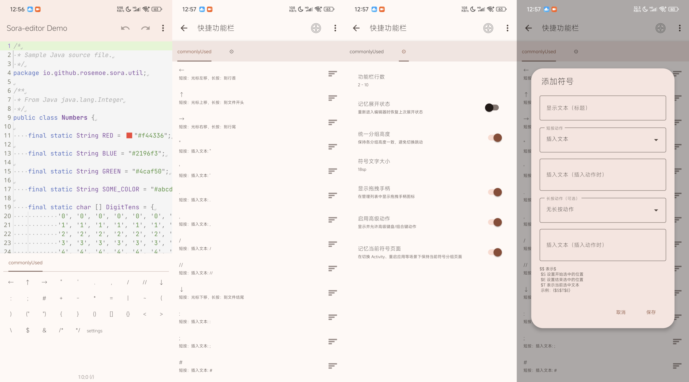

# zero-Symbol-input-view

`zero-Symbol-input-view` 是一个面向 Android 代码/文本编辑场景的**符号输入增强模块**。
模块围绕 **Sora CodeEditor** 构建，提供完整的符号抽屉与管理能力：
分组分页、手势抽屉、可配置分组指示器、符号配置导入导出等。



---

## 1. 模块定位与用途

该模块适用于“高频输入符号/模板/编辑动作”的编辑器应用，例如：

- 代码编辑器
- 脚本工具
- 配置文件编辑器
- 需要快捷编辑动作的文本 IDE

相较普通键盘符号行，本模块可提供：

- 多分组组织与分页切换
- 单个符号支持点击/长按双动作
- 抽屉折叠/展开与拖拽交互
- 多种分组指示器表现形式
- 配置数据的完整管理生命周期

---

## 2. 核心功能

### 2.1 运行时输入抽屉（`AdvancedSymbolInputView`）

- 分组符号页展示与切换
- 折叠/展开高度模型（统一网格计算）
- 手势展开/收起
- 符号短按、长按动作分发
- 可选记忆：上次展开状态、上次分组页
- 分组指示器风格：
  - 标准 Tab
  - 简洁圆点（底部）
  - 隐藏
  - 顶部线条
  - 块状（底部）

### 2.2 符号管理页（`SymbolManagerActivity`）

- 分组管理：新增/编辑/删除/排序
- 符号管理：新增/编辑/复制/移动/删除
- 批量操作
- 剪贴板/文件导入导出
- 设置项：行列、指示器风格、行为选项

### 2.3 动作执行能力

每个符号项可配置：

- 短按动作
- 可选长按动作
- 文本载荷（插入内容/自定义文本）

最终通过 `SymbolActionExecutor` 路由到绑定的编辑器实例执行。

---

## 3. 架构与设计

### 3.1 总体架构

- **视图层**
  - `AdvancedSymbolInputView`
  - `GroupIndicatorBar`
  - 底部紧凑指示器
  - `SymbolPageGridView`
- **数据模型层**
  - `SymbolGroup`、`SymbolItem`、`SymbolUiSettings`
- **持久化层**
  - `SymbolDataManager`（SharedPreferences + JSON）
- **行为层**
  - `SymbolActionExecutor`（编辑器动作分发）

### 3.2 设计原则

1. **数据驱动渲染**：界面由分组/符号配置数据生成。
2. **交互一致性**：抽屉高度与网格布局使用统一公式，避免“行数漂移”。
3. **风格可扩展**：分组指示器与分页逻辑解耦，便于扩展样式。
4. **兼容性优先**：保留旧接口兼容点，同时采用新的内置抽屉模型。

### 3.3 指示器设计说明

分组指示器采用“按风格路由渲染”策略：

- Tab/线条类风格：顶部渲染
- 紧凑圆点/块状：底部渲染
- 隐藏风格：不显示指示器

该设计用于兼顾“信息密度”与“手势空间”。

---

## 4. 接入方式

### 4.1 Gradle

`settings.gradle.kts`

```kotlin
include(":zero-Symbol-input-view")
```

`build.gradle.kts`

```kotlin
dependencies {
    implementation(project(":zero-Symbol-input-view"))
}
```

### 4.2 布局声明

```xml
<android.zero.studio.widget.editor.symbolinput.AdvancedSymbolInputView
    android:id="@+id/symbol_input_view"
    android:layout_width="match_parent"
    android:layout_height="wrap_content" />
```

### 4.3 代码绑定

```kotlin
val symbolInputView = findViewById<android.zero.studio.widget.editor.symbolinput.AdvancedSymbolInputView>(R.id.symbol_input_view)
val editor = findViewById<io.github.rosemoe.sora.widget.CodeEditor>(R.id.editor)

symbolInputView.bindEditor(editor)
symbolInputView.onOpenManagerListener = {
    startActivity(Intent(this, android.zero.studio.widget.editor.symbolinput.SymbolManagerActivity::class.java))
}

override fun onResume() {
    super.onResume()
    symbolInputView.onHostResume()
}

symbolInputView.refreshData() // 配置或数据变更后刷新
```

---

## 5. 数据互通与运维建议

模块支持 JSON 导入导出，可用于团队共享符号配置。

建议：

- 对配置 JSON 做版本管理与备份
- 团队共享预设放入代码仓库
- 生产环境导入前做格式校验

---

## 6. 关键目录

```text
zero-Symbol-input-view/
└── src/main/
    ├── kotlin/android/zero/studio/widget/editor/symbolinput/
    │   ├── AdvancedSymbolInputView.kt
    │   ├── SymbolManagerActivity.kt
    │   ├── SymbolData.kt
    │   ├── SymbolDataManager.kt
    │   └── SymbolActionExecutor.kt
    └── res/
```

---

## 7. 兼容说明

- `AdvancedSymbolInputView.followSystemIme` 仍保留，用于旧集成兼容。
- 从旧版抽屉方案迁移时，建议迁移后主动调用 `refreshData()`。

